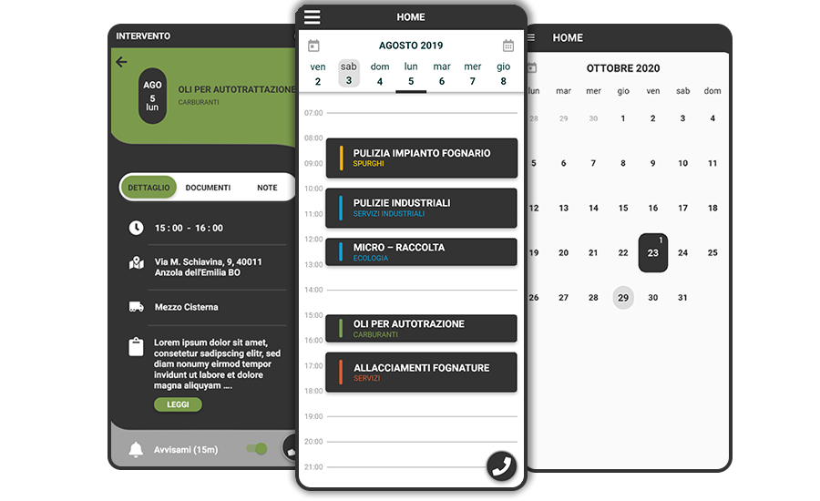
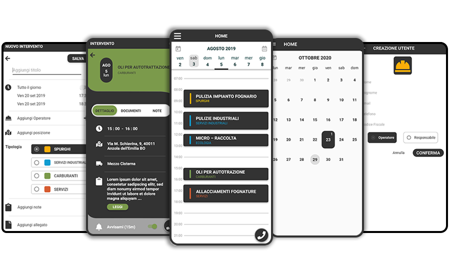

# Flutter_organizer-app

Application for the internal management of the assignments of the employees of a particular company. Calendar and control center for all completed, ongoing or planned jobs.Through the use of Flutter in order to have an application for iOS, Android and WEB.

## Documentation

* [Install Flutter](https://flutter.dev/get-started/)
* [Flutter documentation](https://flutter.dev/docs)
* [App Documentation](https://github.com/johnMinelli/Flutter_organizer-app/wiki)

## About App

This application is used to speed up and improve management and communication within a company. It will become the control center of all your activities where you will be able to have an overall view. The application is divided into two sections, one relating to the manager and one relating to the employee. 

#### Employee View

In  this section the employee can see all his assignments and check the details of them. He may have the option to accept or reject them. You will receive a notification for each assignment assigned.

#### Manager View

In this section the manager can check the progress of a job through its status which is updated at each step in which he will receive a notification. He can also add a task and check past ones. The manager in this section will have an overview of all his employees.

